# Architecture Overview

This document outlines the internal execution pipeline, key design patterns, resource ownership, and platform constraints of GitRunByKaru.

---

## The Execution Pipeline

Every run processes through a linear execution flow coordinated inside [`src/index.js`](src/index.js):

Every stage produces the minimum information required for the next stage, keeping responsibilities isolated and reducing coupling between components.

```
[CLI Options]
   ↓
[Clone & Windows Path Resolve]
   ↓
[Detect Stack & Lockfiles]
   ↓
[Resolve Strategy]
   ↓
[Environment Mocking (.env)]
   ↓
[Install Dependencies (Isolated)]
   ↓
[Spawn Child Process (Safe Process Execution)]
   ↓
[HTTP Server Readiness Check]
   ↓
[Verify HTTP & Launch Browser ➔ Clean Teardown]
```




### Stage Details

1.  **CLI Entry Point (`bin/gitrunbykaru.js`):** Parses parameters and flags (`--port`, `--no-open`, `--keep`) using `commander` and calls the orchestrator.
2.  **Clone (`src/clone.js`):** Performs a shallow clone (`git clone --depth 1`) inside the system's temporary directory. On Windows, it converts the directory path to its physical canonical name using `realpathSync.native()` to bypass 8.3 short-path mapping issues that cause bundlers like Vite to fail.
3.  **Detect (`src/detect.js`):** Scans the root of the cloned files to match stack indicators (such as `package.json`, lockfiles, Python dependency manifests, or HTML indexes).
4.  **Strategy Selection (`src/strategies/`):** Evaluates the matched stack and returns the corresponding execution strategy.
5.  **Environment Prep (`src/runner.js`):** Scans for `.env` template files (e.g. `.env.example`). If found, it populates missing fields with dummy values and writes them to `.env`.
6.  **Install (`src/strategies/`):** Installs package dependencies. For Node, it runs standard installer scripts (using `npx` dynamically if the target manager is not installed globally). For Python, it creates a local virtual environment (`venv`) to keep the global environment clean.
7.  **Application Launch (`src/runner.js`):** Spawns the startup command in a child process (Safe Process Execution). On Windows, it spawns with `shell: true` to resolve path execution binaries.
8.  **HTTP Readiness (`src/runner.js`):** Parses stdout and stderr streams line-by-line using Node's standard `readline` module. Once a port regex is matched, it periodically issues HTTP GET requests until the application responds or a timeout is reached, verifying the application layer is active and responding.
9.  **Browser (`src/runner.js`):** Once the application is confirmed to be responding, GitRunByKaru opens the user's default browser at the local server address.
10. **Cleanup (`src/index.js`):** Signal traps on `SIGINT` and `SIGTERM` kill the process tree and remove the temporary workspace.

---

## Design Principles

GitRunByKaru is intentionally built around a few core engineering principles:

*   **Single Responsibility:** Each stage in the pipeline owns exactly one responsibility (e.g. cloning, stack detection, execution).
*   **Explicit Lifecycle:** Every resource created by the application (cloned files, spawned server processes, socket connections, global event listeners) is tracked, owned, and cleaned up cleanly.
*   **Convention Over Configuration:** Common repository layouts run with zero configuration by adhering to standard framework scripts and dependencies.
*   **Local First:** Everything executes locally on the user's machine, keeping data private and avoiding external API keys or subscription dependencies.
*   **Honest Scope:** The project intentionally avoids solving enterprise deployment scenarios or heavy multi-tab orchestrations, keeping the implementation simple and maintainable.

---

## Strategy Pattern

The project uses the **Strategy Pattern** to separate platform-specific requirements.

The core orchestrator and process runner interact with language runtimes through a unified strategy interface. This separates process lifecycle management from language-specific configuration details.

```
       [Orchestrator]
             │
      [spawnProject]
             │
     ┌───────┼───────┐
     ▼       ▼       ▼
   [Node] [Python] [Static]  <-- Implementation Details
```

---

## Temporary Workspaces

To prevent cluttering local development folders, all repositories are cloned directly into the operating system's temporary directory. 

Unless the `--keep` option is set, the orchestrator deletes these workspaces recursively on exit.

---

## Process Lifecycle & Signals

*   **Signals:** The orchestrator registers listeners for `SIGINT` and `SIGTERM`. If a signal is received, it triggers a cleanup function that terminates active child processes and deletes the temporary workspace.
*   **Orphan prevention:** To avoid leaking background processes, the runner tracks the spawned process ID. On Windows, where executing commands under a shell wrapper can prevent standard signal propagation, the tool calls `taskkill /pid <PID> /f /t` to terminate the entire process tree.
*   **Memory Leaks:** All process event handlers are deregistered using `process.off()` upon completion to prevent memory leaks during programmatic runs.

---

## Architectural Philosophy

GitRunByKaru is intentionally designed as a small, linear pipeline rather than a highly extensible framework.

Every stage has a single responsibility, communicates through explicit interfaces, and cleans up the resources it owns.

The goal is not to support every possible repository layout—it is to make the common case of exploring conventional public repositories fast, predictable, and reliable.
